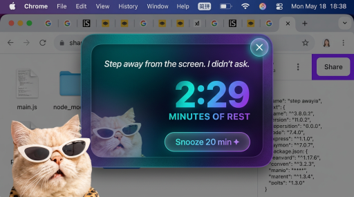

# 🐱 Cat Break

> *A luxury cat that forces you to take breaks.*

A Mac app that watches how long you've been working — and when you've been at it for an hour, a fabulous cat glides across your screen to remind you that even the most iconic need to rest.

---

## ✨ What it does

- ⏱ Tracks your **active** keyboard & mouse time (pauses when you're idle)
- 🐈 After **1 hour** of continuous work, a cat walks across your screen
- 💬 Drops a **random motivational line** with attitude
- ⏳ **3-minute countdown** — then the cat disappears on its own
- 😴 Hit **Snooze** to push it back 20 minutes

---

## 📸 Preview



---

## 💻 Installation (Mac only)

1. Go to [Releases](../../releases) and download the latest `.dmg` file
2. Open the `.dmg` and drag **Cat Break** into your Applications folder
3. Open the app

> **First time opening:** macOS may say the app is "damaged." Fix it by opening Terminal and running:
> ```bash
> xattr -cr /Applications/Cat\ Break.app
> ```
> Then open the app normally. Only needed once.

---

## 🐱 Menu bar icon

Once running, Cat Break lives in your **menu bar** as a 🐱 icon. Click it to:
- See how many minutes you've been active
- Trigger a break manually
- Reset the timer
- Quit the app

## 🧪 Test it instantly

Press **`Cmd + Shift + T`** to trigger the cat immediately (no need to wait an hour).

---

## 🛠 Run locally

```bash
git clone https://github.com/blairlee81-afk/cat-calls-for-break.git
cd cat-calls-for-break
npm install
npm start
```

---

## 🐾 Built with

- [Electron](https://www.electronjs.org/)
- HTML / CSS / JavaScript
- One very fabulous cat

---

## 📄 License

MIT — do whatever you want with it.
